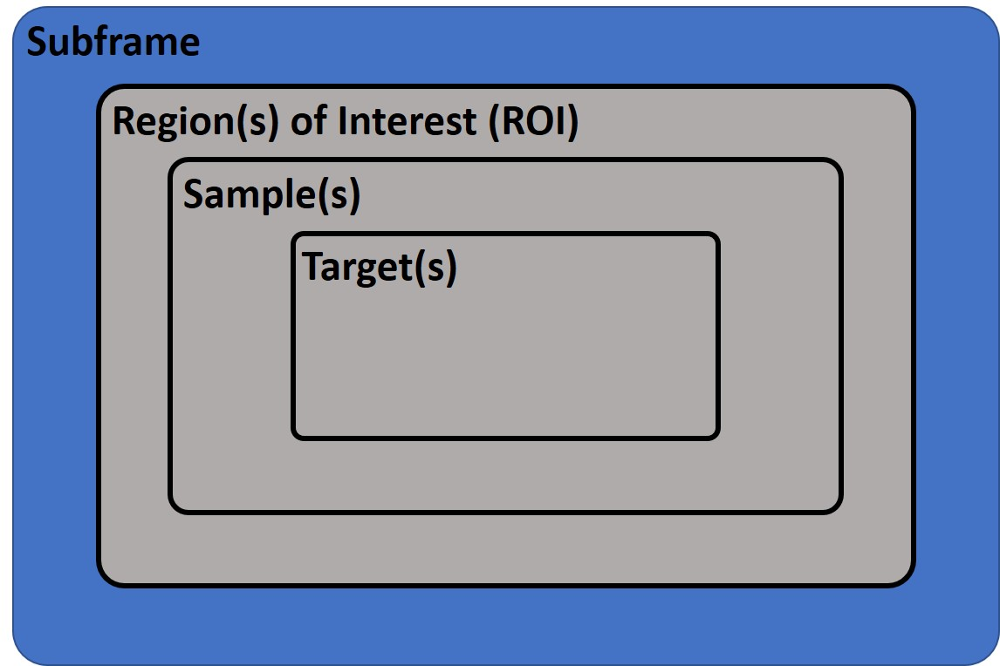

# Targeter Database Interaction

## Project Explanation

A MySQL-based database is implemented to save the information related
to diverse experiments on different microscopes.

The goal is to save the diverse data and read them whenever required for experiment repeatability.

The information is grouped into different levels as shown below:
* Subframe
    * Region(s) of Interest (ROI)
        * Sample
            * Target,

where **Subframe** is the object which holds the imaging material. **Region of Interest** is any region that we are interested to focus on (there could be
one or many ROIs on a Subframe). **Sample** is any area inside the ROI, for example, a cell region (there could be one or many samples on an ROI). **Target** is any point inside a sample (there could be one or many targets on a sample).
**Target**(s) are the points that we want to shoot at with a laser.

The image below shows the structure of the information:

There is a possibility to
1. insert (manually or via XML file)
2. edit
3. view
the information on the database.

The project is implemented with Node.js and EJS.

## Notice:
It is not possible to access the database as the credentials are not provided!
